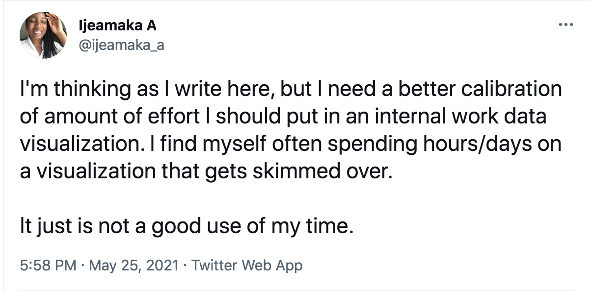
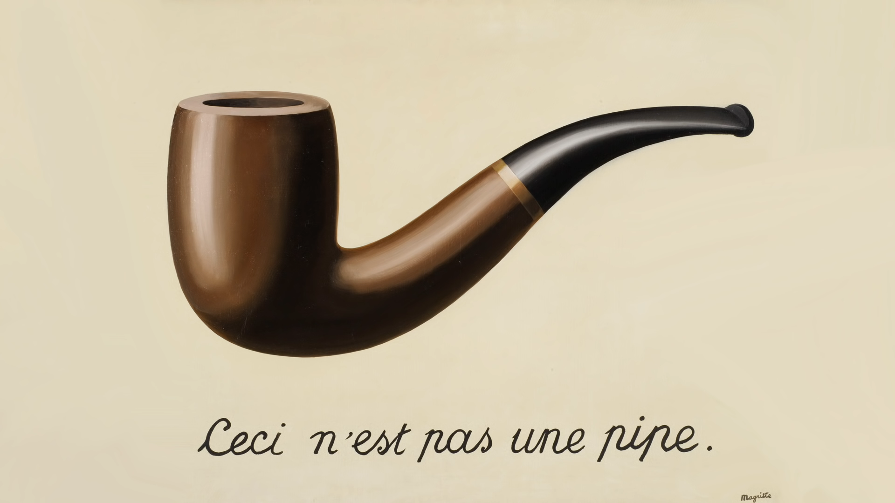
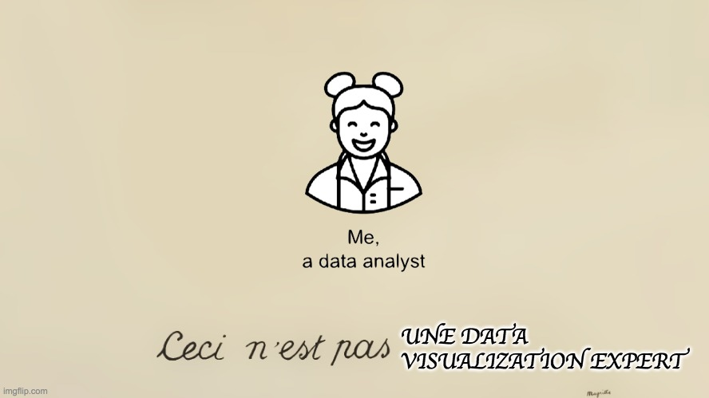
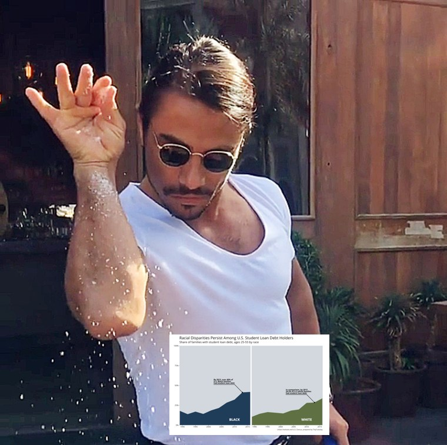

background-image: url("images/toronto_data_010.png")
background-position: top
background-size: cover
background-color: var(--BlueGreen)
class: left, middle


```{r include = FALSE}
knitr::opts_chunk$set(echo = FALSE,
                      fig.retina = 3, 
                      fig.align = 'center')
```

```{r metathis, include = FALSE}
library(metathis)

meta() %>%
  meta_name("github-repo" = "Ijeamakaanyene/spice_up_your_charts") %>%
  meta_social(
    title = "Spice up your standard charts",
    description = paste0(
      "How to create visually interesting standard charts in the most time effective manner",
      "Presented Toronto Data Workshop, August 6th 2021"),
    url = "https://ijeamakaanyene.github.io/spice_up_your_charts/charts.html",
    image = "https://raw.githubusercontent.com/Ijeamakaanyene/spice_up_your_charts/main/slides_cover_image.png",
    image_alt = paste0(
      "Title slide of spice up your standard charts",
      "Authored by Ijeamaka Anyene",
      "Presented at Toronto Data Workshop August 6th, 2021",
      "to the right of this information is a grid of white squares with some missing"),
    og_type = "website",
    og_author = "Ijeamaka Anyene",
    twitter_card_type = "summary_large_image",
    twitter_creator = "@ijeamaka_a",
    twitter_site = "@ijeamaka_a")
```

```{r, xaringanExtra-share-again, echo=FALSE}
xaringanExtra::use_share_again()
```

```{r message = FALSE, warning = FALSE}
library(dplyr)
library(ggplot2)
library(tidyr)
library(kableExtra)
library(ggimage)
library(ragg)

xaringanExtra::use_tachyons()
```


```{r include = FALSE, message = FALSE}
student_debt = readr::read_csv('https://raw.githubusercontent.com/rfordatascience/tidytuesday/master/data/2021/2021-02-09/student_debt.csv') %>%
  filter(race %in% c("White", "Black")) %>%
  select(-loan_debt) %>%
  mutate(loan_debt_pct = round(loan_debt_pct * 100, 1)) 

```

.my-white[
# Spice up your<br>standard charts
**Ijeamaka Anyene**  
**Toronto Data Workshop | August 6th, 2021**
]


---
class: transition-slide, center, middle

.my-green[
## About Me
]


### `r emo::ji("waving_hand")` I'm Ijeamaka Anyene
### `r emo::ji("woman_technologist")` Senior Data Analyst, <br> Kaiser NorCal Division of Research
`r emo::ji("bird")` [@ijeamaka_a](https://twitter.com/ijeamaka_a)  
`r emo::ji("spider_web")` [ijeamaka-anyene.netlify.app](https://ijeamaka-anyene.netlify.app/)  


---
class: transition-slide

```{r out.width = "50%"}
knitr::include_graphics("images/steal_like_artist.jpeg")
```

---
class: transition-slide

```{r out.width = "80%"}

```

---
class: inverse, center, middle

## When starting a visualization,<br>you need to ask yourself:
<hr>
--

### What is my message?
--

### Who is my audience?
--
.yellow[
### How much time do I have? 
]
---
class: middle

```{r, include=FALSE}
fake_data = tibble(
  x = c(2, 8),
  y = 4,
  images = c(here::here("images", "noun_photographer.png"),
             here::here("images", "noun_scientist.png"))
)

```

```{r, fig.width=11}
ggplot(data = fake_data) +
  geom_image(aes(x = x, y = y, image = images),
             size = .25,
             asp = 1.6) +
  geom_text(aes(x = 2, y = 3,
                label = "Me,\na data analyst"),
            size = 7,
            lineheight = 1) +
  geom_text(aes(x = 8, y = 3,
                label = "Data visualization expert"),
            size = 7) +
  geom_segment(aes(x = 0, xend = 10,
                   y = 2, yend = 2),
               arrow = arrow(length = unit(0.5, "cm")),
               size = 2) +
  geom_text(aes(x = 5, y = 1.5, 
                label = "Time available in the work day to perfect your data visualization"),
            size = 9,
            fontface = "bold",
            lineheight = 1) +
  xlim(0, 10) +
  ylim(0, 5) +
  #coord_equal() +
  theme_void() +
  theme(
    text = element_text(family = "Open Sans")
  )
  
```

---
```{r out.width = "80%"}

```


---
```{r out.width = "80%"}

```

---
background-image: url("images/toronto_data_010.png")
background-position: top
background-size: cover
background-color: var(--BlueGreen)
class: left, middle

.my-white[
# Tips to spice<br>up your standard<br>charts within<br>specific time<br>constraints
**Ijeamaka Anyene**  
**Toronto Data Workshop | August 6th, 2021**
]


---
class: center, inverse

.pull-left[
## Ijeamaka's Time-Specific Data Viz Maxims
```{r, out.width = "50%"}

```
]

--

.pull-right[
<br>
### Deadline is tomorrow
### Moderate amount of time
### An abundance of time
]

---
class: transition-slide
## .my-green[Time Available in Workday:] .my-yellow["Deadline is tomorrow"]
<br>
.pull-left[
.center[
### Advice
<hr>
**Start simple then build up**<br>  
**More aesthetics = more complexity**<br>  
**Reduce redundancy, add clarity**<br>
]
]

--

.pull-right[
.center[
### Implement
<hr>
**Standard charts or go-to charts**<br>  
**Non-default aesthetics (colors, text, etc)**<br>  
**Modify legend and axis**<br>  
**Titles, subtitles, and caption**<br>
]
]

---
class: transition-slide
## .my-green[Time Available in Workday:] .my-yellow["A moderate amount"]
<br>
.pull-left[
.center[
### Advice
<hr>
**Emphasize**<br>  
**Less defaults, more customization**<br>  
]
]

--

.pull-right[
.center[
### Implement
<hr>
**Highlights**<br>  
**Annotations**<br>  
**Atypical legends, labels, etc.**<br> 
]
]

---
background-image: url("images/erindataviz_screenshot.png")
background-position: middle
background-size: contain
class: transition-slide, middle, center
--
### "Reduce redundancy, add clarity!"

---
class: transition-slide
## .my-green[Time Available in Workday:] .my-yellow["An abundance of time"]

.pull-left[
.center[
### Advice
<hr>
**Go wild**<br>  
**Have a back up plan**<br>  
]
]

--

.pull-right[
.center[
### Implement
<hr>
**Nonstandard charts or data art**<br>  
**Custom legends**<br>  
**Multiple annotations**<br>  
**Create a table or standard chart as back up**<br>
]
]
---
class: inverse, middle, center

## Let's implement!
--

### But first....

---
class: inverse, middle, center

## Let's talk about tables
<hr>
--

### Tables are underrated
--

### Great way to show the individual values
--

### Easy to make, if data is already wrangled

---
class: transition-slide

.pull-left[
<br>
### TidyTuesday Dataset: Urban Institute and U.S. Census
]

.pull-right[
<br><br>
```{r}
student_debt %>%
  pivot_wider(names_from = race, values_from = loan_debt_pct) %>%
  arrange(year) %>%
  rename(Year = year) %>%
  kable(align = "lrrr", 
        caption = "Racial Disparities in Avg. Family Student Loan Debt") %>%
  kable_classic_2(full_width = T) %>%
  add_header_above(c(" " = 1, 
                     "% of families with debt" = 2))
```
]

---
class: transition-slide

```{r, include = FALSE}
student_debt_annotation = tibble(
  race = c("Black", "White"),
  year = c(2013, 2013),
  loan_debt_pct = c(41.2, 28.5),
  label = c("By 2013, over 40% of\nU.S. Black families\nhad student loan debt",
            "In comparison, by 2013\n28.5% of U.S.white families\nhad student loan debt")
)

```

.left-column[
.my-bluegreen[
### Deadline is tomorrow
]
.my-yellow[
#### Standard charts or go-to charts
]
.my-steelgrey[
#### Non-default aesthetics (colors, text, etc)
#### Modify legend and axis
#### Titles, subtitles, and caption
]
]

.right-column[
```{r fig.width=11}
ggplot(data = student_debt) +
  # Data
  geom_area(aes(x = year, y = loan_debt_pct, fill = race)) +
  theme(
    text = element_text(family = "Open Sans"),
    panel.grid = element_blank()
  )
```
]

---
.left-column[
.my-bluegreen[
### Deadline is tomorrow
]
.my-steelgrey[
#### Standard charts or go-to charts
]
.my-yellow[
#### Non-default aesthetics (colors, text, etc)
]
.my-steelgrey[
#### Modify legend and axis
#### Titles, subtitles, and caption
]
]

.right-column[
```{r fig.width=11}
ggplot(data = student_debt) +
  # Data
  geom_area(aes(x = year, y = loan_debt_pct, fill = race)) +
  labs(x = NULL, y = NULL) +
  facet_wrap(~race) +
  theme(
    text = element_text(family = "Open Sans"),
    panel.grid = element_blank(),
  )
```
]

---
class: transition-slide

.left-column[
.my-bluegreen[
### Deadline is tomorrow
]
.my-steelgrey[
#### Standard charts or go-to charts
]
.my-yellow[
#### Non-default aesthetics (colors, text, etc)
]
.my-steelgrey[
#### Modify legend and axis
#### Titles, subtitles, and caption
]
]

.right-column[
```{r fig.width=11}
ggplot(data = student_debt) +
  # Data
  geom_area(aes(x = year, y = loan_debt_pct, fill = race)) +
  labs(x = NULL, y = NULL) +
  scale_fill_manual(values = c("#1e3d59", "#5f7044", "#ecb920")) +
  facet_wrap(~race) +
  theme(
    text = element_text(family = "Open Sans"),
    axis.text = element_text(size = 10, 
                             color = "black",
                             family = "Open Sans"),
    panel.grid = element_blank(),
    panel.background = element_rect(fill = "#d2d8dd"),
    legend.text = element_text(size = 15, 
                               family = "Open Sans")
  )
```
]

---
class: transition-slide

.left-column[
.my-bluegreen[
### Deadline is tomorrow
]
.my-steelgrey[
#### Standard charts or go-to charts
#### Non-default aesthetics (colors, text, etc)
]
.my-yellow[
#### Modify legend and axis
]
.my-steelgrey[
#### Titles, subtitles, and caption
]
]

.right-column[
```{r fig.width=11}
ggplot(data = student_debt) +
  # Data
  geom_area(aes(x = year, y = loan_debt_pct, fill = race)) +
  labs(x = NULL, y = NULL,
       fill = NULL) +
  scale_y_continuous(limits = c(0, 100),
                     expand = c(0, 0.005), 
                     labels = function(x) paste0(x, "%")) +
  scale_x_continuous(limits = c(1989, 2016),
                     expand = c(0.005, 0.005)) +
  scale_fill_manual(values = c("#1e3d59", "#5f7044", "#ecb920")) +
  facet_wrap(~race) +
  theme(
    text = element_text(family = "Open Sans"),
    axis.text = element_text(size = 10, 
                             color = "black",
                             family = "Open Sans"),
    panel.grid = element_blank(),
    panel.background = element_rect(fill = "#d2d8dd"),
    plot.title = element_text(size = 20, 
                              margin = margin(b = 5),
                              family = "Open Sans"),
    plot.subtitle = element_text(size = 15, 
                                 margin = margin(b = 10),
                                 family = "Open Sans"),
    legend.position = "top",
    legend.justification = 0,
    legend.key = element_blank(),
    legend.text = element_text(size = 15, 
                               family = "Open Sans"),
    strip.text = element_blank(),
    strip.background = element_blank()
  )
```
]

---
class: transition-slide

.left-column[
.my-bluegreen[
### Deadline is tomorrow
]
.my-steelgrey[
#### Standard charts or go-to charts
#### Non-default aesthetics (colors, text, etc)
#### Modify legend and axis
]
.my-yellow[
#### Titles, subtitles, and caption
]
]

.right-column[
```{r fig.width=11}
ggplot(data = student_debt) +
  # Data
  geom_area(aes(x = year, y = loan_debt_pct, fill = race)) +
  labs(x = NULL, y = NULL,
       fill = NULL,
       title = "Racial Disparities Persist Among U.S. Student Loan Debt Holders",
       subtitle =  "Share of families with student loan debt, ages 25-55 by race",
       caption = "Urban Institute and U.S. Census, prepared by TidyTuesday") +
  scale_y_continuous(limits = c(0, 100),
                     expand = c(0, 0.005), 
                     labels = function(x) paste0(x, "%")) +
  scale_x_continuous(limits = c(1989, 2016),
                     expand = c(0.005, 0.005)) +
  scale_fill_manual(values = c("#1e3d59", "#5f7044", "#ecb920")) +
  facet_wrap(~race) +
  theme(
    text = element_text(family = "Open Sans"),
    axis.text = element_text(size = 10, 
                             color = "black",
                             family = "Open Sans"),
    panel.grid = element_blank(),
    panel.background = element_rect(fill = "#d2d8dd"),
    plot.title = element_text(size = 20, 
                              margin = margin(b = 5),
                              family = "Open Sans"),
    plot.subtitle = element_text(size = 15, 
                                 margin = margin(b = 10),
                                 family = "Open Sans"),
    legend.position = "top",
    legend.justification = 0,
    legend.key = element_blank(),
    legend.text = element_text(size = 15, 
                               family = "Open Sans"),
    strip.text = element_blank(),
    strip.background = element_blank()
  )
```
]

---
class: transition-slide

.pull-left[
### Baseline

```{r fig.width=11}
ggplot(data = student_debt) +
  # Data
  geom_area(aes(x = year, y = loan_debt_pct, fill = race)) +
  theme(
    text = element_text(family = "Open Sans"),
    panel.grid = element_blank()
  )
```
]

.pull-right[
### Deadline is tomorrow
```{r fig.width=11}
ggplot(data = student_debt) +
  # Data
  geom_area(aes(x = year, y = loan_debt_pct, fill = race)) +
  labs(x = NULL, y = NULL,
       fill = NULL,
       title = "Racial Disparities Persist Among U.S. Student Loan Debt Holders",
       subtitle =  "Share of families with student loan debt, ages 25-55 by race",
       caption = "Urban Institute and U.S. Census, prepared by TidyTuesday") +
  scale_y_continuous(limits = c(0, 100),
                     expand = c(0, 0.005), 
                     labels = function(x) paste0(x, "%")) +
  scale_x_continuous(limits = c(1989, 2016),
                     expand = c(0.005, 0.005)) +
  scale_fill_manual(values = c("#1e3d59", "#5f7044", "#ecb920")) +
  facet_wrap(~race) +
  theme(
    text = element_text(family = "Open Sans"),
    axis.text = element_text(size = 10, 
                             color = "black",
                             family = "Open Sans"),
    panel.grid = element_blank(),
    panel.background = element_rect(fill = "#d2d8dd"),
    plot.title = element_text(size = 20, 
                              margin = margin(b = 5),
                              family = "Open Sans"),
    plot.subtitle = element_text(size = 15, 
                                 margin = margin(b = 10),
                                 family = "Open Sans"),
    legend.position = "top",
    legend.justification = 0,
    legend.key = element_blank(),
    legend.text = element_text(size = 15, 
                               family = "Open Sans"),
    strip.text = element_blank(),
    strip.background = element_blank()
  )
```
]

---
class: transition-slide

.left-column[
.my-bluegreen[
### Moderate Amount
]
.my-yellow[
#### Highlights
]
.my-steelgrey[
#### Annotations
#### Atypical legends, labels, etc.
]
]

.right-column[
```{r fig.width=11}
ggplot(data = student_debt) +
  # Data
  geom_area(aes(x = year, y = loan_debt_pct, fill = race)) +
  # Annotations - Black
  geom_segment(data = student_debt_annotation,
               aes(x = year, xend = 2010,
                   y = loan_debt_pct, 
                   yend = loan_debt_pct + 10),
               lineend = "round",
               size = .75,
               color = "black") +
  geom_segment(data = student_debt_annotation,
               aes(x = 2002, xend = 2010,
                   y = loan_debt_pct + 10, 
                   yend = loan_debt_pct + 10),
               lineend = "round",
               size = .75,
               color = "black") +
  geom_point(data = student_debt_annotation,
             aes(x = year, 
                 y = loan_debt_pct),
             size = 2.5,
             shape = 16,
             color = "black") +
  labs(x = NULL, y = NULL,
       fill = NULL,
       title = "Racial Disparities Persist Among U.S. Student Loan Debt Holders",
       subtitle =  "Share of families with student loan debt, ages 25-55 by race",
       caption = "Urban Institute and U.S. Census, prepared by TidyTuesday") +
  scale_y_continuous(limits = c(0, 100),
                     expand = c(0, 0.005), 
                     labels = function(x) paste0(x, "%")) +
  scale_x_continuous(limits = c(1989, 2016),
                     expand = c(0.005, 0.005)) +
  scale_fill_manual(values = c("#1e3d59", "#5f7044", "#ecb920")) +
  facet_wrap(~race) +
  theme(
    text = element_text(family = "Open Sans"),
    axis.text = element_text(size = 10, 
                             color = "black",
                             family = "Open Sans"),
    panel.grid = element_blank(),
    panel.background = element_rect(fill = "#d2d8dd"),
    plot.title = element_text(size = 20, 
                              margin = margin(b = 5),
                              family = "Open Sans"),
    plot.subtitle = element_text(size = 15, 
                                 margin = margin(b = 10),
                                 family = "Open Sans"),
    legend.position = "top",
    legend.justification = 0,
    legend.key = element_blank(),
    legend.text = element_text(size = 15, 
                               family = "Open Sans"),
    strip.text = element_blank(),
    strip.background = element_blank()
  )
```
]

---
class: transition-slide

.left-column[
.my-bluegreen[
### Moderate Amount
]
.my-steelgrey[
#### Highlights
]
.my-yellow[
#### Annotations
]
.my-steelgrey[
#### Atypical legends, labels, etc.
]
]

.right-column[
```{r, fig.width = 11}
ggplot(data = student_debt) +
  # Data
  geom_area(aes(x = year, y = loan_debt_pct, fill = race)) +
  # Annotations - Black
  geom_segment(data = student_debt_annotation,
               aes(x = year, xend = 2010,
                   y = loan_debt_pct, 
                   yend = loan_debt_pct + 10),
               lineend = "round",
               size = .75,
               color = "black") +
  geom_segment(data = student_debt_annotation,
               aes(x = 2002, xend = 2010,
                   y = loan_debt_pct + 10, 
                   yend = loan_debt_pct + 10),
               lineend = "round",
               size = .75,
               color = "black") +
  geom_point(data = student_debt_annotation,
             aes(x = year, 
                 y = loan_debt_pct),
             size = 2.5,
             shape = 16,
             color = "black") +
  geom_text(data = student_debt_annotation,
            aes(x = 2002, 
                y = loan_debt_pct + 14, 
                label = label),
            family = "Open Sans",
            fontface = "bold",
            size = 3.5,
            lineheight = 0.75,
            hjust = 0) +
  labs(x = NULL, y = NULL,
       fill = NULL,
       title = "Racial Disparities Persist Among U.S. Student Loan Debt Holders",
       subtitle =  "Share of families with student loan debt, ages 25-55 by race",
       caption = "Urban Institute and U.S. Census, prepared by TidyTuesday") +
  scale_y_continuous(limits = c(0, 100),
                     expand = c(0, 0.005), 
                     labels = function(x) paste0(x, "%")) +
  scale_x_continuous(limits = c(1989, 2016),
                     expand = c(0.005, 0.005)) +
  scale_fill_manual(values = c("#1e3d59", "#5f7044", "#ecb920")) +
  facet_wrap(~race) +
  theme(
    text = element_text(family = "Open Sans"),
    axis.text = element_text(size = 10, 
                             color = "black",
                             family = "Open Sans"),
    panel.grid = element_blank(),
    panel.background = element_rect(fill = "#d2d8dd"),
    plot.title = element_text(size = 20, 
                              margin = margin(b = 5),
                              family = "Open Sans"),
    plot.subtitle = element_text(size = 15, 
                                 margin = margin(b = 10),
                                 family = "Open Sans"),
    legend.position = "top",
    legend.justification = 0,
    legend.key = element_blank(),
    legend.text = element_text(size = 15, 
                               family = "Open Sans"),
    strip.text = element_blank(),
    strip.background = element_blank()
  )
```
]

---
class: transition-slide

.left-column[
.my-bluegreen[
### Moderate Amount
]
.my-steelgrey[
#### Highlights
#### Annotations
]
.my-yellow[
#### Atypical legends, labels, etc.
]
]

.right-column[
```{r, fig.width = 11}
ggplot(data = student_debt) +
  # Data
  geom_area(aes(x = year, y = loan_debt_pct, fill = race)) +
  # Label of race / alternative legend
  geom_text(aes(x = 2010, y = 7, label = stringr::str_to_upper(race)),
            fontface = "bold",
            family = "Open Sans",
            size = 6,
            color = "white") +
  # Annotations - Black
  geom_segment(data = student_debt_annotation,
               aes(x = year, xend = 2010,
                   y = loan_debt_pct, 
                   yend = loan_debt_pct + 10),
               lineend = "round",
               size = .75,
               color = "black") +
  geom_segment(data = student_debt_annotation,
               aes(x = 2002, xend = 2010,
                   y = loan_debt_pct + 10, 
                   yend = loan_debt_pct + 10),
               lineend = "round",
               size = .75,
               color = "black") +
  geom_point(data = student_debt_annotation,
             aes(x = year, 
                 y = loan_debt_pct),
             size = 2.5,
             shape = 16,
             color = "black") +
  geom_text(data = student_debt_annotation,
            aes(x = 2002, 
                y = loan_debt_pct + 14, 
                label = label),
            family = "Open Sans",
            fontface = "bold",
            size = 3.5,
            lineheight = 0.75,
            hjust = 0) +
  labs(x = NULL, y = NULL,
       title = "Racial Disparities Persist Among U.S. Student Loan Debt Holders",
       subtitle =  "Share of families with student loan debt, ages 25-55 by race",
       caption = "Urban Institute and U.S. Census, prepared by TidyTuesday") +
  scale_y_continuous(limits = c(0, 100),
                     expand = c(0, 0.005), 
                     labels = function(x) paste0(x, "%")) +
  scale_x_continuous(limits = c(1989, 2016),
                     expand = c(0.005, 0.005)) +
  scale_fill_manual(values = c("#1e3d59", "#5f7044", "#ecb920")) +
  facet_wrap(~race) +
  theme(
    text = element_text(family = "Open Sans"),
    axis.text = element_text(size = 10, 
                             color = "black",
                             family = "Open Sans"),
    panel.grid = element_blank(),
    panel.background = element_rect(fill = "#d2d8dd"),
    plot.title = element_text(size = 20, 
                              margin = margin(b = 5),
                              family = "Open Sans"),
    plot.subtitle = element_text(size = 15, 
                                 margin = margin(b = 10),
                                 family = "Open Sans"),
    legend.position = "none",
    strip.text = element_blank(),
    strip.background = element_blank()
  )
```
]


---
class: transition-slide

.pull-left[
### Deadline is tomorrow
```{r fig.width=11}
ggplot(data = student_debt) +
  # Data
  geom_area(aes(x = year, y = loan_debt_pct, fill = race)) +
  labs(x = NULL, y = NULL,
       fill = NULL,
       title = "Racial Disparities Persist Among U.S. Student Loan Debt Holders",
       subtitle =  "Share of families with student loan debt, ages 25-55 by race",
       caption = "Urban Institute and U.S. Census, prepared by TidyTuesday") +
  scale_y_continuous(limits = c(0, 100),
                     expand = c(0, 0.005), 
                     labels = function(x) paste0(x, "%")) +
  scale_x_continuous(limits = c(1989, 2016),
                     expand = c(0.005, 0.005)) +
  scale_fill_manual(values = c("#1e3d59", "#5f7044", "#ecb920")) +
  facet_wrap(~race) +
  theme(
    text = element_text(family = "Open Sans"),
    axis.text = element_text(size = 10, 
                             color = "black",
                             family = "Open Sans"),
    panel.grid = element_blank(),
    panel.background = element_rect(fill = "#d2d8dd"),
    plot.title = element_text(size = 20, 
                              margin = margin(b = 5),
                              family = "Open Sans"),
    plot.subtitle = element_text(size = 15, 
                                 margin = margin(b = 10),
                                 family = "Open Sans"),
    legend.position = "top",
    legend.justification = 0,
    legend.key = element_blank(),
    legend.text = element_text(size = 15, 
                               family = "Open Sans"),
    strip.text = element_blank(),
    strip.background = element_blank()
  )
```
]

.pull-right[
### Moderate amount
```{r, fig.width = 11}
ggplot(data = student_debt) +
  # Data
  geom_area(aes(x = year, y = loan_debt_pct, fill = race)) +
  # Label of race / alternative legend
  geom_text(aes(x = 2010, y = 7, label = stringr::str_to_upper(race)),
            fontface = "bold",
            family = "Open Sans",
            size = 6,
            color = "white") +
  # Annotations - Black
  geom_segment(data = student_debt_annotation,
               aes(x = year, xend = 2010,
                   y = loan_debt_pct, 
                   yend = loan_debt_pct + 10),
               lineend = "round",
               size = .75,
               color = "black") +
  geom_segment(data = student_debt_annotation,
               aes(x = 2002, xend = 2010,
                   y = loan_debt_pct + 10, 
                   yend = loan_debt_pct + 10),
               lineend = "round",
               size = .75,
               color = "black") +
  geom_point(data = student_debt_annotation,
             aes(x = year, 
                 y = loan_debt_pct),
             size = 2.5,
             shape = 16,
             color = "black") +
  geom_text(data = student_debt_annotation,
            aes(x = 2002, 
                y = loan_debt_pct + 14, 
                label = label),
            family = "Open Sans",
            fontface = "bold",
            size = 3.5,
            lineheight = 0.75,
            hjust = 0) +
  labs(x = NULL, y = NULL,
       title = "Racial Disparities Persist Among U.S. Student Loan Debt Holders",
       subtitle =  "Share of families with student loan debt, ages 25-55 by race",
       caption = "Urban Institute and U.S. Census, prepared by TidyTuesday") +
  scale_y_continuous(limits = c(0, 100),
                     expand = c(0, 0.005), 
                     labels = function(x) paste0(x, "%")) +
  scale_x_continuous(limits = c(1989, 2016),
                     expand = c(0.005, 0.005)) +
  scale_fill_manual(values = c("#1e3d59", "#5f7044", "#ecb920")) +
  facet_wrap(~race) +
  theme(
    text = element_text(family = "Open Sans"),
    axis.text = element_text(size = 10, 
                             color = "black",
                             family = "Open Sans"),
    panel.grid = element_blank(),
    panel.background = element_rect(fill = "#d2d8dd"),
    plot.title = element_text(size = 20, 
                              margin = margin(b = 5),
                              family = "Open Sans"),
    plot.subtitle = element_text(size = 15, 
                                 margin = margin(b = 10),
                                 family = "Open Sans"),
    legend.position = "none",
    strip.text = element_blank(),
    strip.background = element_blank()
  )
```
]
---
class: transition-slide

```{r out.width = "50%"}

```

---

background-image: url("images/toronto_data_09.png")
background-position: top
background-size: cover
background-color: var(--BlueGreen)
class: left, middle


.my-white[
# Thank you <br>for attending!
**Twitter: @ijeamaka_a**  
**Github: ijeamakaanyene/spice_up_your_charts**
]